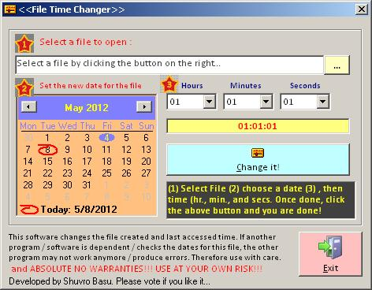



## FileTime Changer

### Description

This small application helps you to change the last access date and time and file created date and time. Has been helpful at times.
 
### More Info
 

             |
---                |---
**Submitted On**   |2012-05-08 22:52:32
**By**             |[Shuvro Basu](https://github.com/Planet-Source-Code/PSCIndex/blob/master/ByAuthor/shuvro-basu.md)
**Level**          |Intermediate
**User Rating**    |5.0 (10 globes from 2 users)
**Compatibility**  |VB 6\.0
**Category**       |[Files/ File Controls/ Input/ Output](https://github.com/Planet-Source-Code/PSCIndex/blob/master/ByCategory/files-file-controls-input-output__1-3.md)
**World**          |[Visual Basic](https://github.com/Planet-Source-Code/PSCIndex/blob/master/ByWorld/visual-basic.md)
**Archive File**   |[FileTime\_C222363582012\.zip](https://github.com/Planet-Source-Code/shuvro-basu-filetime-changer__1-74354/archive/master.zip)

